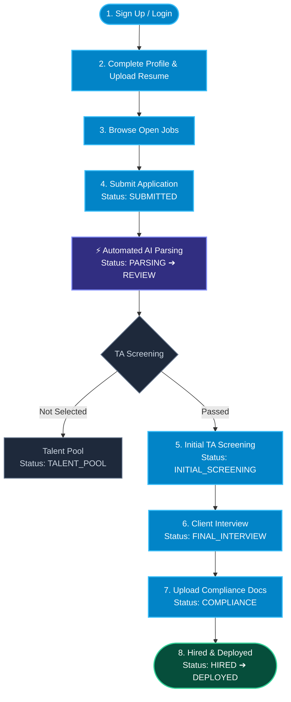
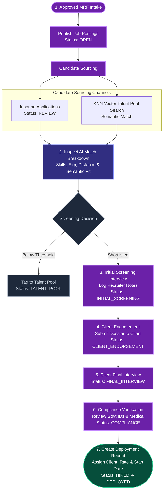
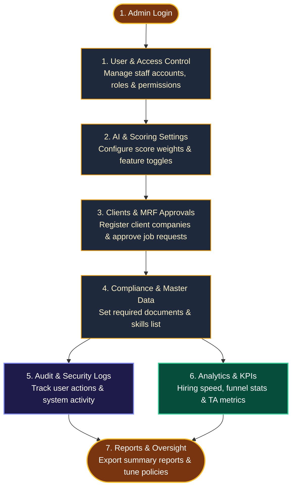

# MEGS Recruitment Platform — Workflow Flowcharts

This directory contains separated, downloadable flowcharts for each of the three primary roles in the MEGS platform:

1. 👤 **[Applicant Flowchart](file:///c:/Users/cnico/OneDrive/Desktop/MEGS/docs/flowcharts/applicant_flowchart.svg)**
2. 🎯 **[Talent Acquisition (TA) Flowchart](file:///c:/Users/cnico/OneDrive/Desktop/MEGS/docs/flowcharts/ta_flowchart.svg)**
3. ⚙️ **[Administrator Flowchart](file:///c:/Users/cnico/OneDrive/Desktop/MEGS/docs/flowcharts/admin_flowchart.svg)**
4. 🌐 **[Integrated 3-Role Swimlane Flowchart](file:///c:/Users/cnico/OneDrive/Desktop/MEGS/docs/flowcharts/integrated_system_flowchart.svg)**
5. 💻 **[Interactive Web Hub &amp; Exporter](file:///c:/Users/cnico/OneDrive/Desktop/MEGS/docs/flowcharts/flowcharts_hub.html)** *(Open in browser to preview & export to SVG/PNG/PDF)*

---

## 1. 👤 Applicant User Journey

---

## 2. 🎯 Talent Acquisition (TA) Recruiter Workflow

---

## 3. ⚙️ Administrator Governance Flowchart

---

## 4. 🌐 Multi-Role Summary

| Role | Core Focus | Key Responsibilities |
| :--- | :--- | :--- |
| 👤 **Applicant** | Candidate Job Journey | Profile setup, job applications, interview attendance, compliance document submission |
| 🎯 **Talent Acquisition (TA)** | Sourcing & Pipeline | MRF intake, candidate screening, AI score review, client endorsement, compliance checks |
| ⚙️ **Administrator** | Governance & Oversight | User RBAC, AI scoring setup, client & MRF approvals, audit logs, and KPI reporting |
